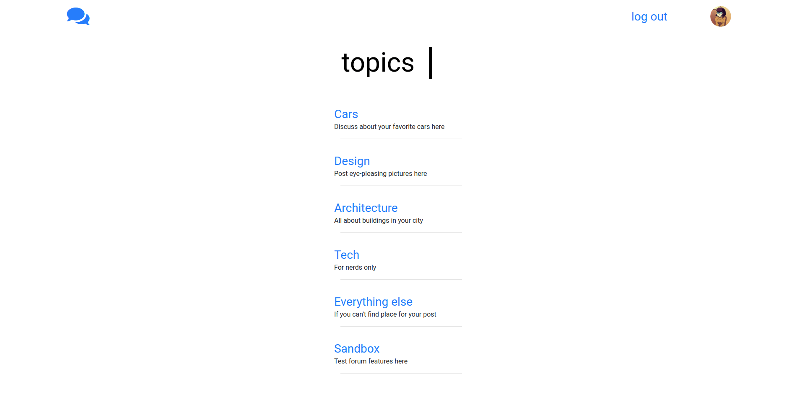
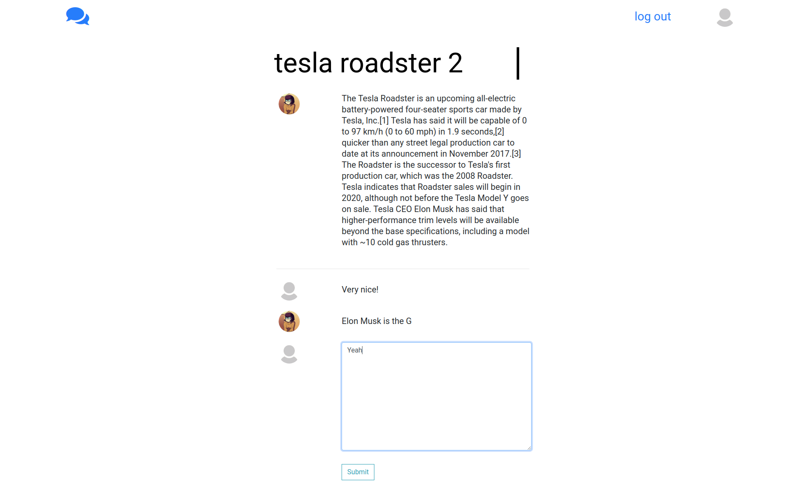

# django-forum
Django-based forum web application with minimalist design.

## Dependencies:
 - `Pillow`
 - `django`
 - `django-crispy-forms`
 
 You can install these using `pip install -r requirements.txt`

## Running:

#### Manually

After cloning this repo, create the database:
`python3 manage.py migrate --run-syncdb`

and then create admin account by running:
`python3 manage.py createsuperuser`

Then you should be able to run the server and create some topics at [localhost:8000/admin](localhost:8000/admin). I plan to create sample database with some data in future.

## Features:
#### User system
- registration, login, update profile (change profile picture, change email...)

#### Posts
- user can create post under topics created by admins (all by gui)
- user can edit his posts, or delete them.

post list view inside topic:

comments list/create view under posts:

## TODO:

- posts and comments formatting
- search
- private messages
